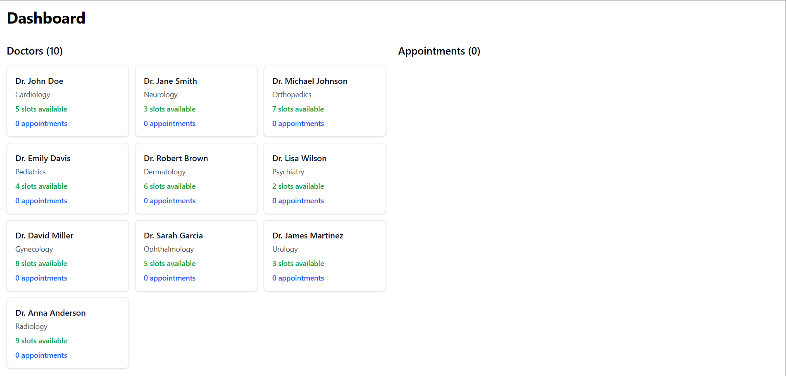
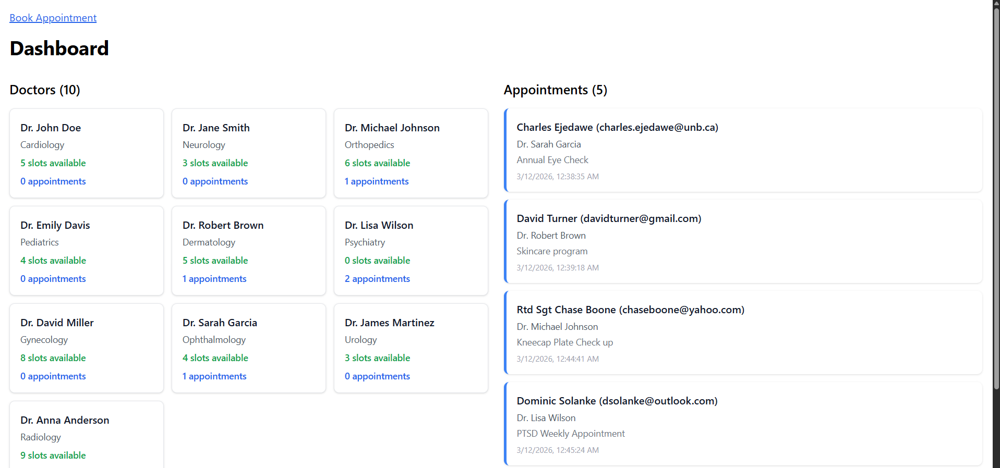
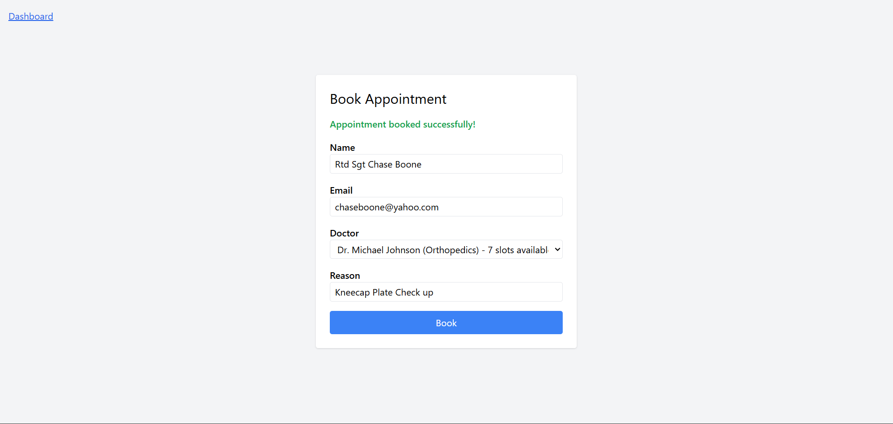
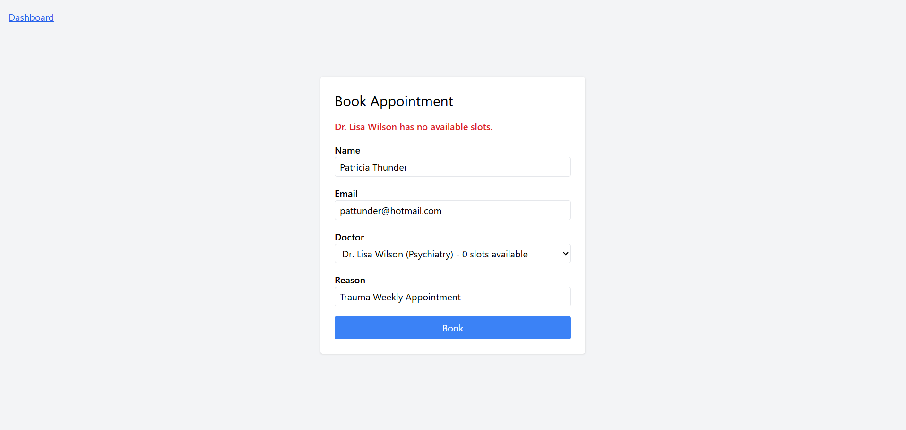

# Lab 3: Microservice Communication — Synchronous & Asynchronous

## Overview

In this lab you will build a **hospital appointment booking system** composed of four microservices. The system demonstrates two fundamental communication styles used in real-world microservice architectures:

- **Synchronous communication** via HTTP REST (request/response)
- **Asynchronous communication** via RabbitMQ message queues (fire-and-forget / event-driven)

## Architecture

```
                        ┌──────────────────────┐
         HTTP POST      │                      │
  Client ─────────────► │ Appointment Service  │
         ◄───────────── │     (port 5001)      │
         JSON response  │                      │
                        └──────────┬───────────┘
                                   │
                    ┌──────────────┴──────────────┐
                    │                             │
           HTTP (synchronous)           AMQP (asynchronous)
                    │                             │
                    ▼                             ▼
         ┌──────────────────┐       ┌──────────────────────┐
         │                  │       │       RabbitMQ       │
         │  Doctor Service  │       │                      │
         │   (port 5002)    │       │  Exchange: "appts"   │
         │                  │       │  (fanout)            │
         └──────────────────┘       │                      │
                                    │  ┌──────────────────┐│
                                    │  │ notifications Q  ││
                                    │  └────────┬─────────┘│
                                    │           │          │
                                    │  ┌────────┴─────────┐│
                                    │  │    records Q     ││
                                    │  └────────┬─────────┘│
                                    └───────────┼──────────┘
                                                │
                             ┌──────────────────┴──────────────────┐
                             │                                      │
                             ▼                                      ▼
               ┌─────────────────────────┐          ┌──────────────────────────┐
               │   Notification Service  │          │      Records Service      │
               │    (queue consumer)     │          │     (queue consumer)      │
               └─────────────────────────┘          └──────────────────────────┘
```

### Communication Summary


| From                | To                   | Protocol | Style        | Why                                                          |
| --------------------- | ---------------------- | ---------- | -------------- | -------------------------------------------------------------- |
| Appointment Service | Doctor Service       | HTTP     | Synchronous  | Booking depends on whether a slot is actually available      |
| Appointment Service | RabbitMQ exchange    | AMQP     | Asynchronous | Notifications and records do not affect the booking response |
| RabbitMQ            | Notification Service | AMQP     | Asynchronous | Worker consumes at its own pace                              |
| RabbitMQ            | Records Service      | AMQP     | Asynchronous | Worker consumes at its own pace                              |

---

## Running the System

Once your implementation is complete, the following commands should bring everything up:

```bash
docker compose build
docker compose up
```

To stop and remove containers:

```bash
docker compose down
```

---

## Bruno Test

### 1. Check the doctor roster

### 2. Book a valid appointment

### 3. Verify the slot was decremented

## Added Addition NextJS Front-end Simple Appointment Booking Form and Dashboard

No Appointments yet



Dashboard With Appointments



Appointment Booking Form




Appointment Booking with no available seats error



